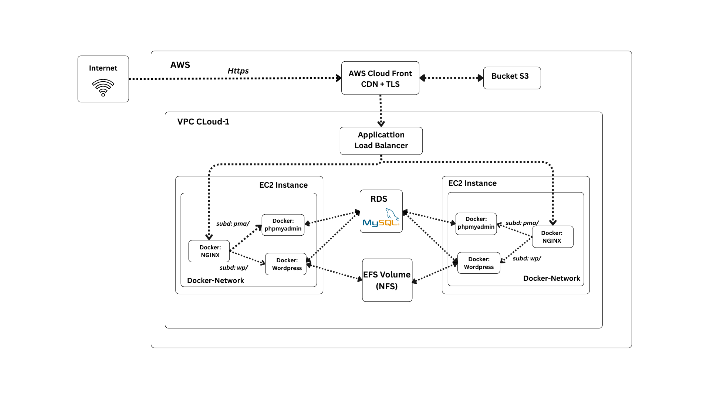

# ☁️ Cloud-1 — DevOps Infrastructure & Automation

Welcome to the **Cloud-1 Project** — a hands-on DevOps initiative developed as part of the **42 School curriculum**.  
This repository demonstrates how to **design, provision, and manage cloud infrastructure** using industry-standard tools like:

- 🏗️ **Terraform** for Infrastructure as Code (IaC)
- ⚙️ **Ansible** for configuration management and provisioning
- 🐳 **Docker Compose** for container orchestration

The objective is to **automate the deployment of a complete WordPress application stack**, including:

- A reverse-proxied **NGINX frontend**
- A **PHP-FPM** backend running WordPress from source
- A **MySQL** database with persistent storage
- A **phpMyAdmin** interface for database management

All services are deployed on **scalable AWS infrastructure**, with a strong focus on:

- ✅ Security best practices (TLS, SSM, ALB)
- ✅ Data persistence (EFS, RDS)
- ✅ Automation and maintainability (IaC, CI/CD-ready)

---

  

---

## 📚 Table of Contents

1. [📦 01 — Prerequisites](Docs/01-prerequisites.md)  
2. [🏗️ 02 — Infrastructure with Terraform](02-infrastructure-terraform.md)  
3. [🛠️ 03 — Provisioning with Ansible](03-provisioning-ansible.md)  
4. [🐳 04 — Docker Stack Deployment](04-deployment-docker.md)  
5. [🌐 05 — DNS with Route 53](05-dns-route53.md)  
6. [🔐 06 — HTTPS with ACM and CloudFront](06-ssl-cloudfront.md)  
7. [🛡️ 07 — Hardening and Monitoring](07-hardening-and-monitoring.md)  
8. [✅ 08 — Conclusion](conclusion.md)

---

## 🧭 Project Objectives

- Automate the deployment of a WordPress stack on AWS
- Use **Terraform** for infrastructure as code (IaC)
- Use **Ansible** for configuration management
- Orchestrate services with **Docker Compose**
- Secure infrastructure using **SSM**, **TLS**, and **IAM**
- Persist data using **RDS** and **EFS**
- Route traffic via **ALB**, **CloudFront**, and custom DNS
- Apply DevOps best practices for idempotency and automation

---

## 📌 Evaluation Highlights (from subject)

- ✅ 1 container = 1 process (e.g. nginx, php-fpm, MySQL…)
- ✅ Infrastructure must be reproducible & restartable
- ✅ Fully automated deployment (no manual setup)
- ✅ Services reachable via ALB and secure (TLS)
- ✅ Data must persist across reboots (EFS, RDS)
- ✅ No SSH — only AWS SSM for access
- ✅ docker-compose.yml required

---

Ready to get started? 👉 Head to [01 — Prerequisites](Docs/01-prerequisites.md)
